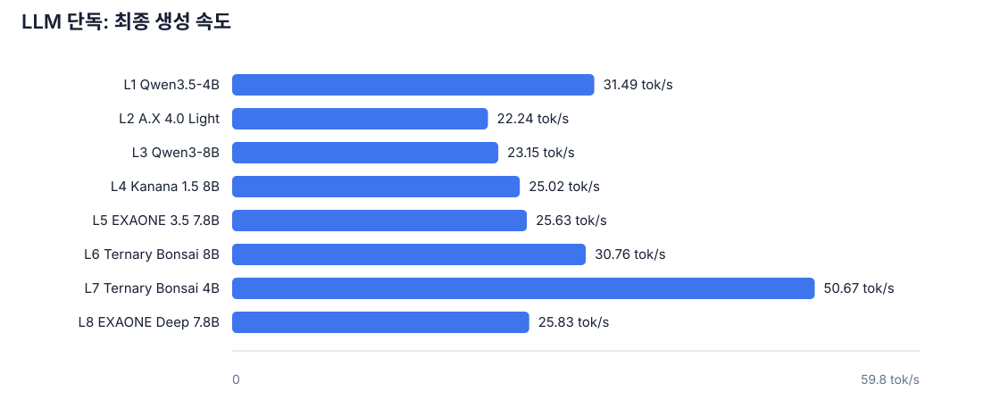
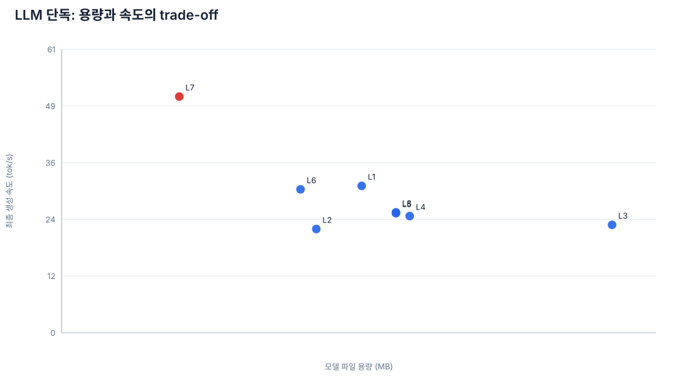
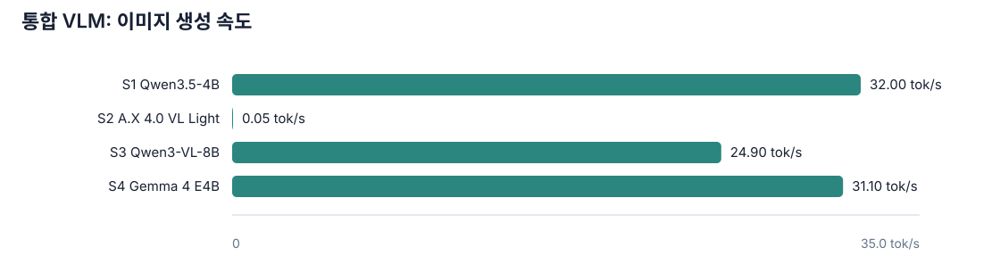
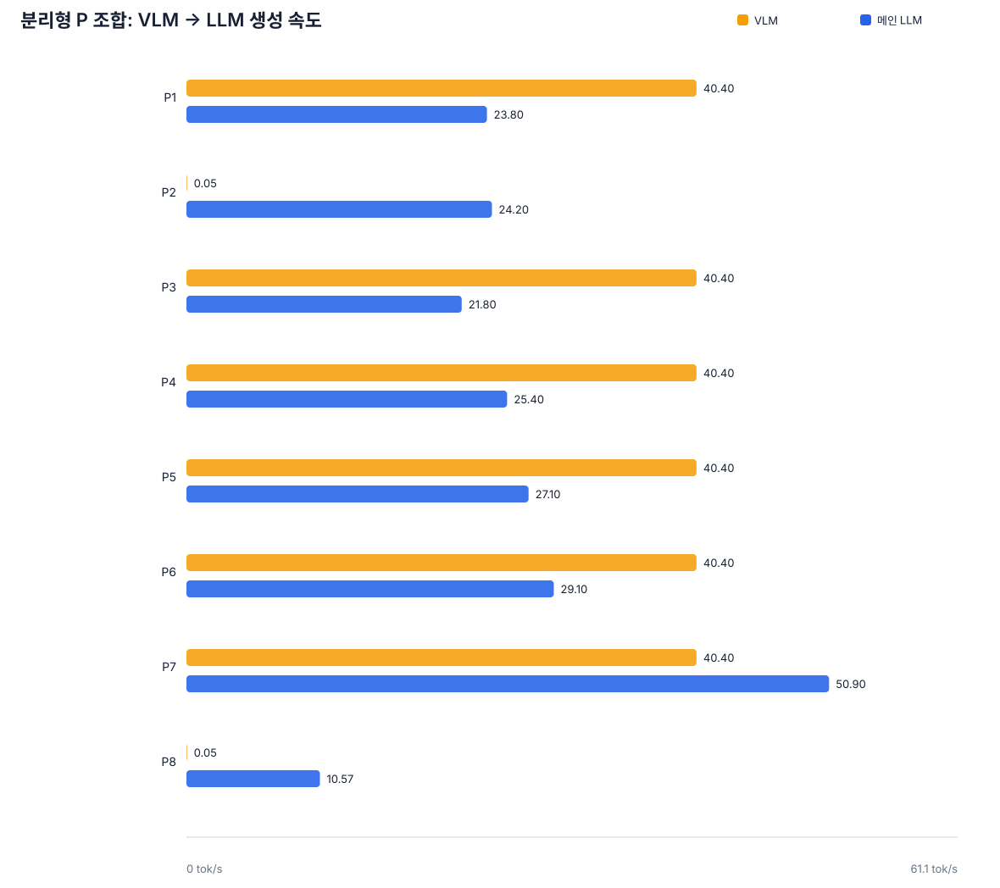
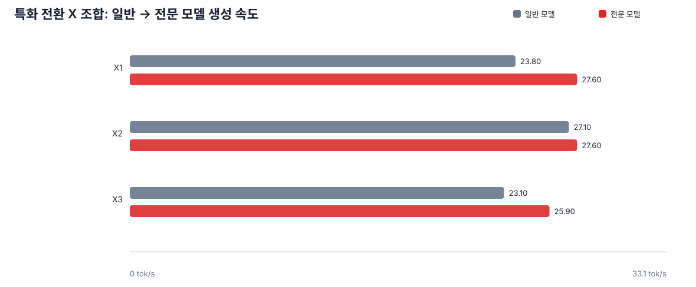
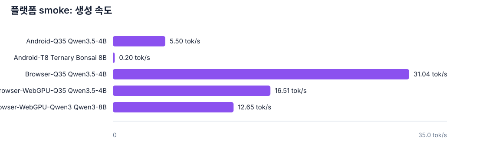

# 로컬 LLM/VLM 검증 결과 분석

생성일: 2026-08-07  
원본 범위: `benchmarks/results/coverage.json`의 S/L/P/X 23개 조합  
측정 정의: `measured`는 이름 그대로의 모델 또는 handoff가 실제 로컬 런타임에서 최소 1회 실행됐다는 뜻입니다. 품질 점수는 수집하지 않았으므로 속도·용량을 품질 우열로 해석하지 않습니다.

## 핵심 결론

1. 단일 LLM 속도 1위는 **L7 Ternary Bonsai 4B (50.67 tok/s)**이고, 가장 작은 단일 파일은 **L7 Ternary Bonsai 4B (1075.0 MB)**입니다.
2. Qwen3.5-4B(L1)는 31.49 tok/s로 통합 멀티모달 기준점 역할을 합니다. 통합 VLM 중 생성 속도는 **S1 Qwen3.5-4B (32.00 tok/s)**가 가장 높았습니다.
3. A.X VL Light(S2)는 공식 BF16 원본을 직접 로드했지만 이미지 생성이 **0.0463 tok/s**로 매우 느렸습니다. P2/P8도 LLM 자체보다 VLM 단계(177.3초, 176.1초)가 전체 지연을 지배합니다.
4. P2의 메인 LLM은 24.20 tok/s, P8의 메인 LLM은 10.57 tok/s였지만, 두 조합 모두 VLM BF16 원본을 포함해 약 17.7GB/20.4GB 저장공간이 필요합니다.
5. 표준 게이트(3 cold load·20회 요청·20분 열 안정성·TTFT)를 완전히 충족하지 못한 결과가 **29개**입니다. 현재 자료는 후보 선별용 1차 실행 분석이지 배포 인증 시험이 아닙니다.

## 전체 조합 검증 감사

- 요청 조합: **23개**, 실제 로컬 실행 증거 보유: **23개**, 누락: **0개**
- 조합 실행 상태: measured **23개**, not_run **0개**
- 표준 배포 게이트: pass **0개**, incomplete **23개**
- 브라우저 WebGPU 직접 실행은 Qwen3.5-4B·Qwen3-8B cold/warm smoke입니다. Qwen3.5-9B는 4.8GB 다운로드까지 완료했지만 WebGPU 커널 컴파일 단계에서 renderer가 응답하지 않아 추론 미측정으로 기록했습니다. Android는 Qwen3.5-4B·Ternary Bonsai 8B·EXAONE Deep 7.8B 에뮬레이터 smoke입니다. 나머지 조합은 해당 플랫폼에서 실행됐다고 간주하지 않습니다.

## 그래프

## 해석 가이드

- `tok/s`는 생성 단계 속도이며 prompt 처리속도나 첫 토큰 지연과 동일하지 않습니다.
- P 조합의 VLM/LLM 속도는 서로 다른 모델 단계의 값입니다. 합산해 단일 모델 속도로 비교하면 안 되고, end-to-end 지연은 `wall_seconds`와 VLM 생성 시간을 함께 봐야 합니다.
- Android 값은 Pixel 9 API 35 에뮬레이터 CLI smoke입니다. 실제 APK UI·물리기기·20분 열 안정성 결과가 아닙니다.
- `Browser-Q35`는 Headless Chrome UI에서 Apple Silicon의 localhost `llama-server`로 보낸 텍스트 경로입니다. `Browser-WebGPU-Q35`는 WebLLM 모델을 브라우저 캐시에 받고 WebGPU에서 직접 생성한 결과입니다.
- 브라우저 WebGPU 직접 측정은 Qwen3.5-4B cold load 1회(238.433초), decode 16.51 tok/s, TTFT 2.854초, Qwen3-8B cold load 1회(439.337초), decode 12.65 tok/s, TTFT 3.000초입니다. Qwen3.5-9B는 파라미터 다운로드 570초 후 컴파일에서 중단됐습니다. 모델 파일 개별 SHA-256과 장시간 열 안정성은 아직 검증하지 않았습니다.
- 동일 브라우저 캐시를 재사용한 warm load는 6.647초, decode 21.35 tok/s, TTFT 0.833초였습니다. 이 warm 값은 별도 1회 측정이라 반복 중앙값으로 해석하면 안 됩니다.
- Qwen3-8B warm load는 11.712초, decode 14.56 tok/s, TTFT 1.639초였습니다.
- 기존 브라우저 측정은 성능 비교를 위해 `max_tokens=96`으로 실행했습니다. 이는 모델 한도가 아니라 테스트 페이지의 설정이며, 페이지 기본값은 학생 답변용으로 256으로 늘렸습니다.
- 품질·안전·한국어 자연스러움은 고정 task catalog에 대한 별도 채점이 필요합니다. 이 보고서는 실행 성능과 자원 비용만 정량화합니다.

정규화 데이터: [normalized_metrics.csv](normalized_metrics.csv)  
원본 coverage: [coverage.json](../../benchmarks/results/coverage.json)
